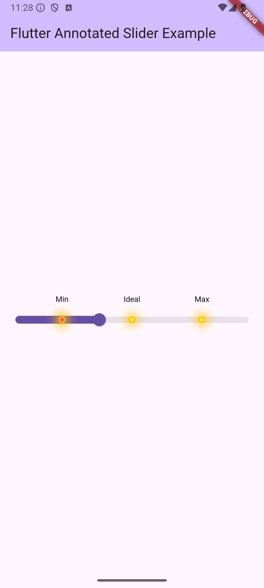
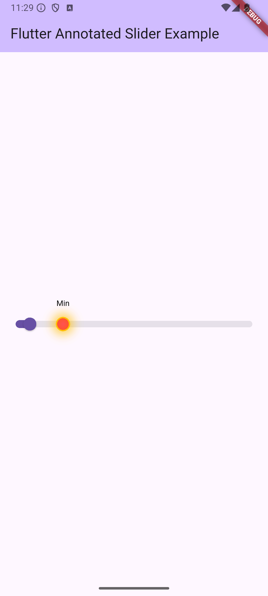

# annotated_slider

A powerful and customizable Flutter slider widget that supports **annotations**, **marker labels**, **custom marker shapes**, and **tick marks** — ideal for building intuitive UI components where users need visual cues along a slider.





[](https://pub.dev/packages/annotated_slider)
[](LICENSE)
[](https://flutter.dev)

---

## 🚀 Why Use `annotated_slider`?

Flutter’s built-in slider is functional, but lacks customization for real-world UX needs like:

✅ Marking meaningful thresholds (e.g., "Low", "Optimal", "High")  
✅ Positioning labeled markers on the track  
✅ Custom drawing of marker shapes (circles, icons, etc.)  
✅ Full control over theme, tick marks, overlay, and more

---

## ✨ Features

- 🔢 Define **a list of marker labels** with **corresponding normalized positions**.
- 🎯 Create **custom marker shapes** by extending `AnnotatedSliderMarkerShape`.
- 🎨 Full theming support via `AnnotatedSliderTheme`.
- 📏 Add tick marks and adjust track/overlay/indicator shapes.
- 💡 Easy integration with existing forms, filters, and control panels.

---

## 📦 Installation

Add to your `pubspec.yaml`:

```yaml
dependencies:
  annotated_slider: ^0.0.1
